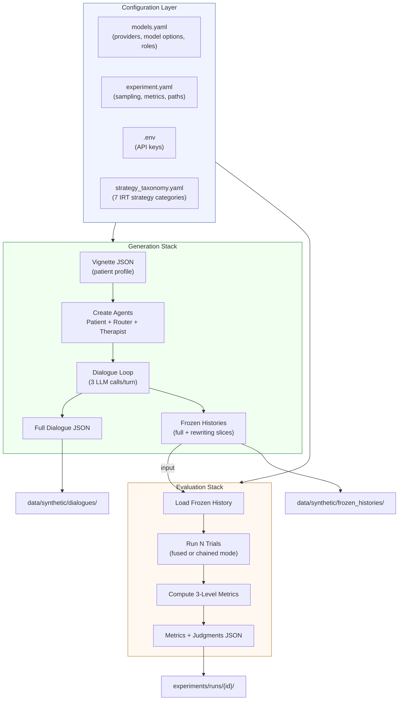
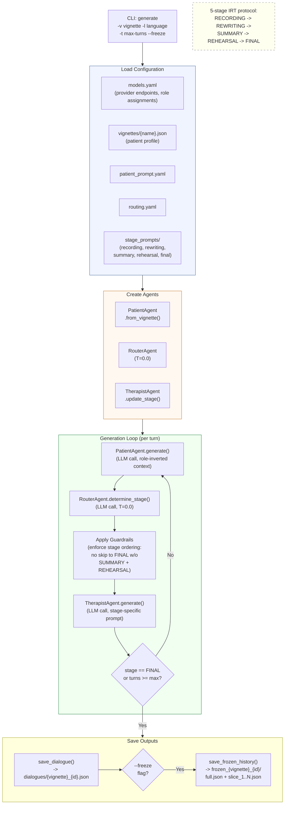
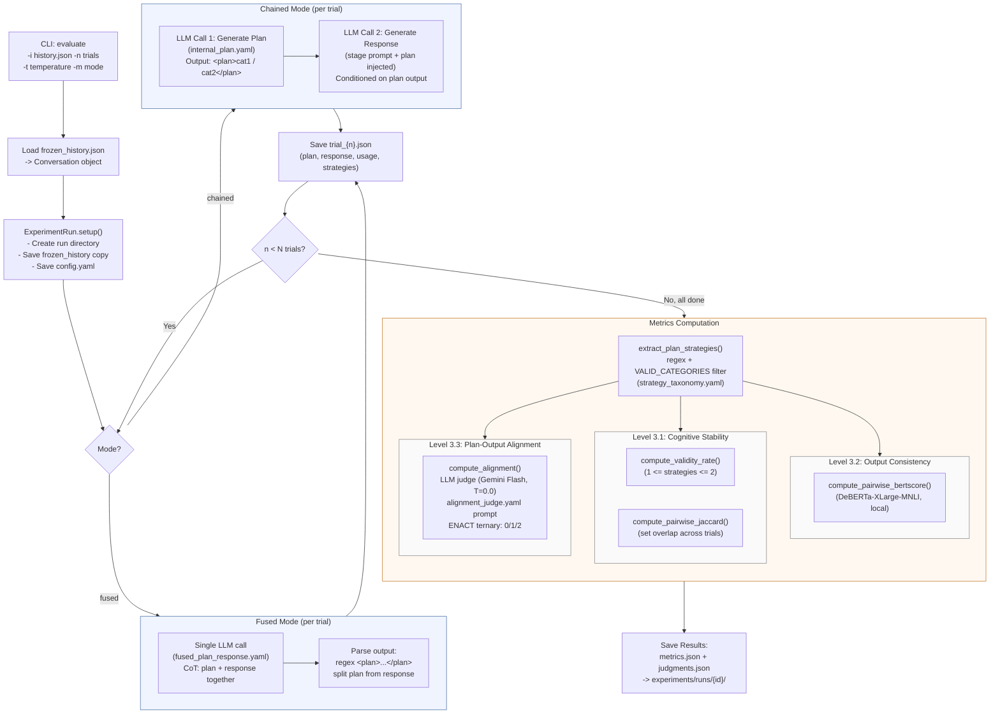
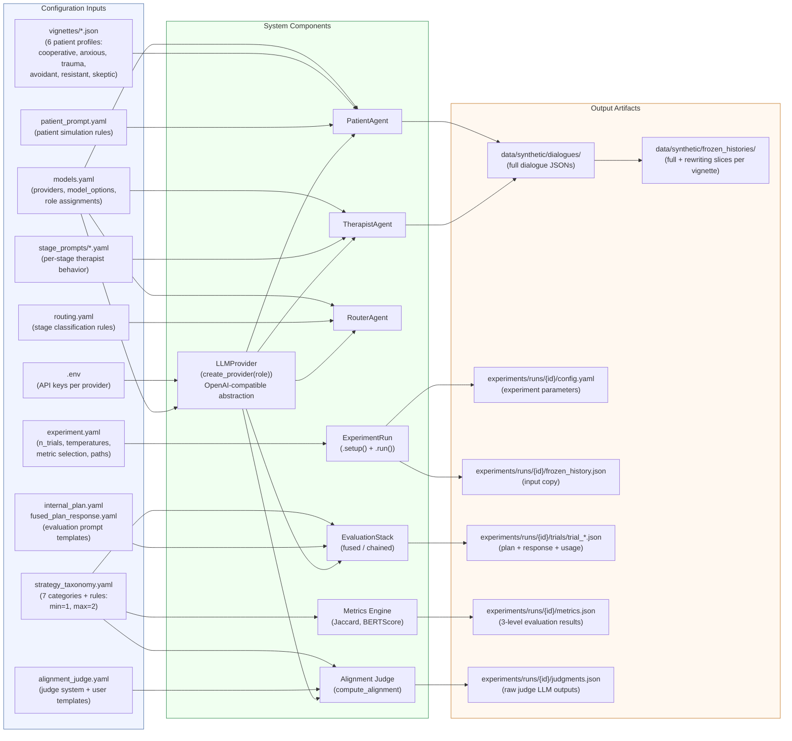

# Pipeline Architecture

This document provides visual documentation of the Measure-AI-Drift pipeline using Mermaid diagrams. The system comprises a **Generation Stack** that produces synthetic therapy dialogues and an **Evaluation Stack** that measures rescripting stability across repeated trials. All diagrams render natively on GitHub.

---

## 1. System Overview

The two stacks operate sequentially: generation produces dialogues and frozen histories, evaluation consumes frozen histories and produces multi-level metrics. Configuration files drive both stacks, and all LLM calls flow through a single provider abstraction.

---

## 2. Generation Stack

A single dialogue generation traces from CLI invocation through three cooperating agents to saved output artifacts. Each turn involves three LLM calls: patient generates a message, router classifies the IRT stage, and therapist responds with a stage-appropriate prompt. The patient agent uses **role inversion** (therapist messages become `"user"` in its context) so the LLM produces patient-style responses.

---

## 3. Evaluation Stack

Evaluation loads a frozen history (a full dialogue or a rewriting-stage slice) and runs N independent trials, each producing a plan and therapeutic response. Two modes are supported: **fused** (single LLM call with CoT-style `<plan>` block) and **chained** (separate plan then response calls). After all trials complete, three levels of metrics are computed, including an LLM judge call for plan-output alignment.

---

## 4. Configuration & Data Flow

This diagram maps every configuration file to the components that consume it, and every component to the output artifacts it produces. The strategy taxonomy is a single source of truth: it is interpolated into LLM prompts (via `build_categories_block()`), used for plan extraction validation, and injected into the alignment judge prompt.

